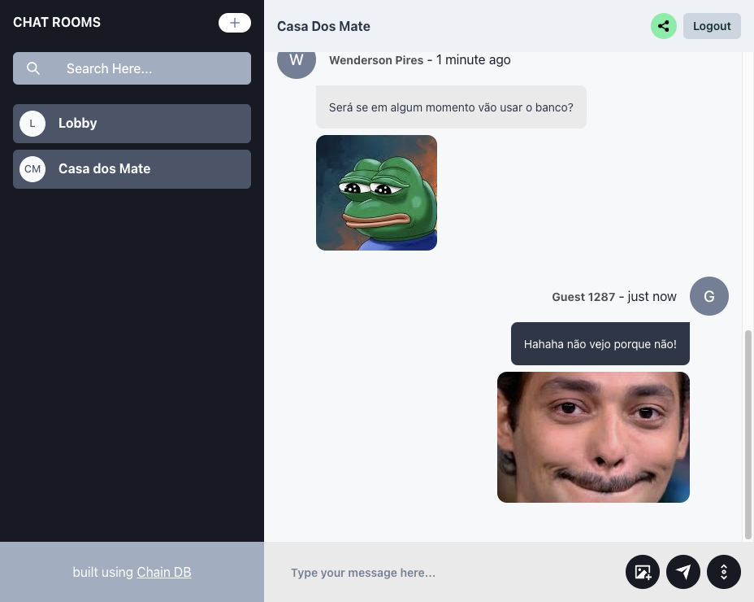

# Chain Chat App

Um aplicativo de chat em tempo real construído com [ChainDB](https://github.com/wpdas/chain-db), um banco de dados que mantém um histórico completo de alterações.



## Sobre o Projeto

ChainChat é uma aplicação de chat em salas que demonstra o poder do ChainDB como solução de armazenamento para aplicações em tempo real. Utilizando o cliente TypeScript [chain-db-ts](https://github.com/wpdas/chain-db-ts), o aplicativo oferece:

- **Autenticação de usuários** - Crie uma conta com nome de usuário e senha
- **Salas de chat** - Crie novas salas ou participe de salas existentes
- **Mensagens em tempo real** - Comunicação instantânea usando WebSockets
- **Histórico completo** - Acesso ao histórico de todas as mensagens anteriores

## Tecnologias Utilizadas

- **Frontend/Backend**: React/Next.js, ChakraUI
- **Banco de Dados**: [ChainDB](https://github.com/wpdas/chain-db)
- **Cliente DB**: [chain-db-ts](https://github.com/wpdas/chain-db-ts)

## Por que ChainDB?

O ChainDB foi escolhido como banco de dados para este projeto devido às suas características únicas:

1. **Histórico Completo** - Cada mensagem é preservada no histórico, permitindo visualizar a evolução das conversas
2. **Segurança** - Dados criptografados com AES-256-GCM
3. **Eventos em Tempo Real** - Suporte nativo a WebSockets para atualizações em tempo real
4. **Simplicidade** - API intuitiva e fácil de usar
5. **Confiabilidade** - Operações atômicas com capacidade de rollback
6. **Filtro de buscas** - Operações de buscas com filtros

## Estrutura de Dados

O ChainChat utiliza quatro tabelas principais no ChainDB:

### Tabela de Usuários

```typescript
interface UserSchema {
  id: string
  username: string
  password: string
}
```

### Tabela de Salas

```typescript
interface RoomSchema {
  rooms: Room[]
}
```

### Tabela de Mensagens

```typescript
interface MessageSchema {
  username?: string
  message?: string
  b64Image?: string
  timestamp?: number
}
```

### Tabela de Registro de Usuários com Conta

Esta é uma tabela estratégica para pode fazer uma tipo de link entre propriedade de tabelas.

```typescript
interface UserIdsSchema {
  id: string // same id as UserSchema.id
  username: string // user name. this is used to get the user table
}
```

## Funcionalidades

- [x] Registro e login de usuários
- [x] Criação de salas de chat
- [x] Envio de mensagens em tempo real
- [x] Histórico de mensagens
- [x] Listagem de salas disponíveis
- [x] Participação em múltiplas salas
- [ ] Mensagens privadas (em desenvolvimento)
- [ ] Notificações (em desenvolvimento)
- [x] Compartilhamento de fotos

## Contribuição

Contribuições são bem-vindas! Sinta-se à vontade para abrir issues ou enviar pull requests.

## Licença

Este projeto está licenciado sob a licença MIT - veja o arquivo [LICENSE](LICENSE) para mais detalhes.

## Agradecimentos

- [ChainDB](https://github.com/wpdas/chain-db) - O banco de dados que torna este projeto possível
- [chain-db-ts](https://github.com/wpdas/chain-db-ts) - Cliente TypeScript para o ChainDB
